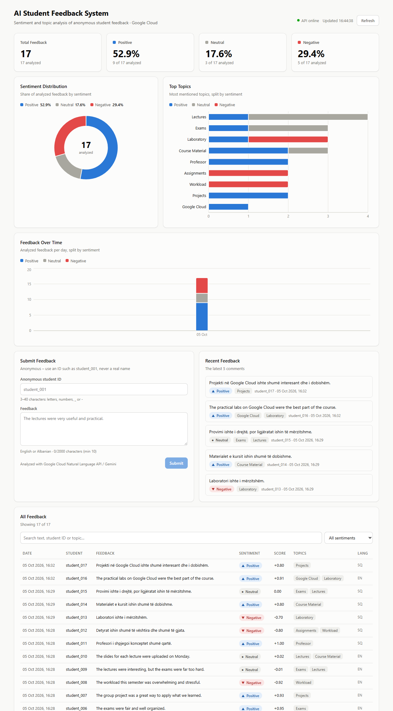
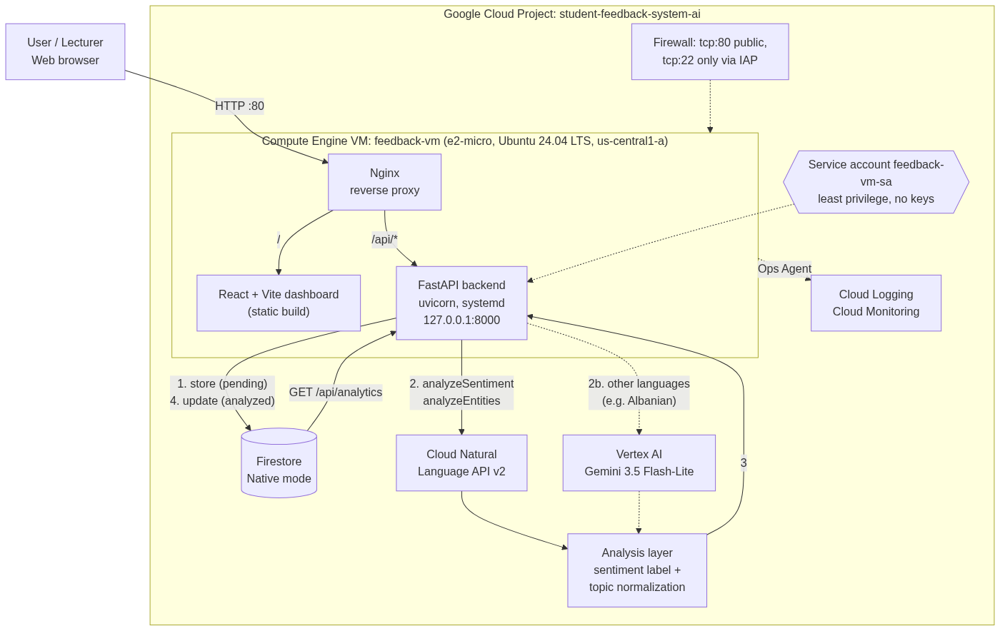
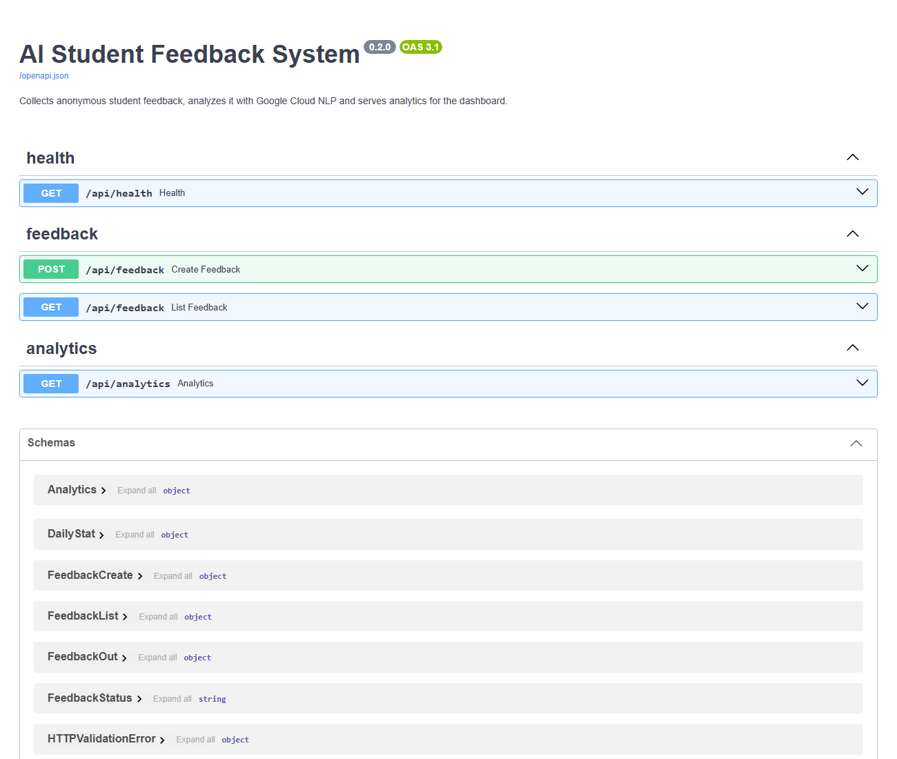

# AI Student Feedback System

A cloud application that collects anonymous student feedback, stores it in a cloud database, analyzes its **sentiment** and **main topics** with Google Cloud NLP services, and presents the results on a live dashboard.

Built as a practical project for the *Cloud Computing* course (Master in Computer Science) on **Google Cloud Platform**.

**Live demo:** http://136.115.200.121 · **API docs:** http://136.115.200.121/docs



---

## Contents

- [Project Overview](#project-overview)
- [Architecture](#architecture)
- [Technologies](#technologies)
- [Google Cloud Services](#google-cloud-services)
- [Project Structure](#project-structure)
- [Installation](#installation)
- [Configuration and Environment Variables](#configuration-and-environment-variables)
- [Running the Backend](#running-the-backend)
- [Running the Frontend](#running-the-frontend)
- [API Endpoints](#api-endpoints)
- [Database](#database)
- [NLP Pipeline](#nlp-pipeline)
- [Testing](#testing)
- [Deployment](#deployment)
- [Monitoring and Logging](#monitoring-and-logging)
- [Security](#security)
- [Screenshots](#screenshots)
- [Future Improvements](#future-improvements)

---

## Project Overview

The system:

1. accepts anonymous student comments (identified only by an ID such as `student_001`);
2. stores them in **Cloud Firestore**;
3. sends them to the **Cloud Natural Language API** (or to **Gemini on Vertex AI** for languages the Natural Language API does not officially support, such as Albanian);
4. classifies the sentiment as **positive / neutral / negative**;
5. identifies the main topics (lectures, assignments, exams, professor, laboratory, ...);
6. shows statistics, charts and the feedback table on a **React dashboard**. Every number is computed from the database, and none is hard-coded.

## Architecture



Source: [`architecture/architecture.mmd`](architecture/architecture.mmd) (Mermaid).

**Request flow for `POST /api/feedback`:**

```text
Browser → Nginx (:80) → FastAPI
   1. validate + clean the text
   2. store in Firestore with status "pending"   (feedback is never lost)
   3. Natural Language API: sentiment + language
        ├─ supported language → entity analysis → topics
        └─ other language (sq) → Gemini, structured JSON → sentiment + English topics
   4. score → label, topics → normalized
   5. update the Firestore document → status "analyzed"
   6. return the result → the dashboard refreshes analytics
```

Design decisions:

| Decision | Reason |
|---|---|
| A single e2-micro VM serving both frontend and backend | Course requirement (VM); inside the GCP free tier |
| Nginx in front of FastAPI, which listens only on `127.0.0.1:8000` | Only port 80 is public; static files and API share one origin (no CORS in production) |
| Firestore instead of Cloud SQL | Serverless, free tier, JSON documents match the NLP output; no instance to pay for or manage |
| Natural Language API + Gemini fallback | NL API is the purpose-built NLP service; Gemini covers Albanian and returns English topic labels, so topics from all languages group together |
| No service account keys | The VM's attached service account provides credentials (Application Default Credentials) |

## Technologies

| Layer | Technology |
|---|---|
| Backend | Python 3.12, FastAPI, Pydantic v2, pydantic-settings, Uvicorn |
| Google client libraries | `google-cloud-firestore`, `google-cloud-language` (v2), `google-genai` |
| Frontend | React 19, Vite, Recharts |
| Web server / process manager | Nginx, systemd |
| Infrastructure | Google Compute Engine, Ubuntu 24.04 LTS |

## Google Cloud Services

| Service | Use |
|---|---|
| Compute Engine | VM `feedback-vm` (e2-micro, 30 GB standard disk, us-central1-a), static IP `feedback-ip` |
| Firestore (Native mode) | Cloud database, collection `feedback` |
| Cloud Natural Language API v2 | `analyzeSentiment`, `analyzeEntities` |
| Vertex AI – Gemini 3.5 Flash-Lite | Sentiment and topics for languages not officially supported by the NL API |
| IAM | Service account `feedback-vm-sa` with least-privilege roles |
| Identity-Aware Proxy | SSH access without a public port 22 |
| Cloud Logging / Monitoring | VM and application logs and metrics (Ops Agent) |
| Cloud Billing | Free Trial, budget alert |

## Project Structure

```text
ai-student-feedback-system/
├── backend/
│   ├── app/
│   │   ├── main.py                 # FastAPI app, CORS, routers
│   │   ├── config.py               # settings from environment / .env
│   │   ├── database.py             # Firestore client (ADC)
│   │   ├── models/feedback.py      # Firestore document model
│   │   ├── schemas/                # request/response models
│   │   ├── routes/                 # health, feedback, analytics
│   │   ├── services/
│   │   │   ├── nlp_client.py       # Natural Language API + Gemini
│   │   │   ├── sentiment_service.py
│   │   │   ├── topic_service.py
│   │   │   ├── feedback_service.py
│   │   │   └── analytics_service.py
│   │   └── utils/text.py           # text preprocessing
│   ├── scripts/                    # test runner, reset, re-analyze
│   ├── requirements.txt
│   └── .env.example
├── frontend/                       # React + Vite dashboard
├── deploy/                         # Nginx site, systemd unit, VM setup script
├── architecture/                   # diagram (Mermaid + PNG)
├── docs/testing/test_results.md    # test report
└── screenshots/
```

## Installation

Requirements: Python 3.12, Node.js 20+, Git, [Google Cloud CLI](https://cloud.google.com/sdk/docs/install), and a Google Cloud project with the Firestore, Natural Language and Vertex AI APIs enabled.

```bash
git clone https://github.com/bujari09/ai-student-feedback-system.git
cd ai-student-feedback-system
gcloud auth application-default login
gcloud auth application-default set-quota-project <PROJECT_ID>
```

## Configuration and Environment Variables

Copy `backend/.env.example` to `backend/.env`. The file holds **configuration only, never credentials**.

| Variable | Default | Description |
|---|---|---|
| `APP_ENV` | `development` | `development` or `production` |
| `LOG_LEVEL` | `INFO` | Python log level |
| `GCP_PROJECT_ID` | – | Google Cloud project ID (required) |
| `FIRESTORE_DATABASE` | `(default)` | Firestore database |
| `FIRESTORE_COLLECTION` | `feedback` | Collection name |
| `NL_SUPPORTED_LANGUAGES` | `en,es,fr,de,it,pt,ja,ko,zh,zh-Hant` | Languages analyzed by the Natural Language API |
| `GEMINI_MODEL` | `gemini-3.5-flash-lite` | Vertex AI model for other languages |
| `GEMINI_LOCATION` | `global` | Vertex AI location |
| `SENTIMENT_POSITIVE_THRESHOLD` | `0.25` | Score at or above this is positive |
| `SENTIMENT_NEGATIVE_THRESHOLD` | `-0.25` | Score at or below this is negative |
| `CORS_ORIGINS` | `http://localhost:5173` | Allowed frontend origins (comma-separated) |

Frontend: `frontend/.env.example` → `VITE_API_BASE_URL` (empty = same origin).

## Running the Backend

```bash
cd backend
python -m venv .venv
source .venv/bin/activate          # Windows: .venv\Scripts\activate
pip install -r requirements.txt
cp .env.example .env
uvicorn app.main:app --reload --port 8000
```

Open http://127.0.0.1:8000/docs for the interactive API documentation.

## Running the Frontend

```bash
cd frontend
npm install
npm run dev        # http://localhost:5173, /api is proxied to :8000
npm run build      # production build in frontend/dist
```

## API Endpoints

| Method | Endpoint | Description |
|---|---|---|
| GET | `/api/health` | Service status and Firestore connectivity |
| POST | `/api/feedback` | Submit feedback; it is stored, analyzed and returned with sentiment and topics |
| GET | `/api/feedback?limit=50` | Latest feedback (1–200) |
| GET | `/api/analytics?top_n=10` | Totals, sentiment counts and distribution, average score, top topics with sentiment split, feedback per day, languages |

Example:

```bash
curl -X POST http://136.115.200.121/api/feedback \
  -H "Content-Type: application/json" \
  -d '{"anonymous_student_id": "student_001", "feedback_text": "The lectures were very useful and practical."}'
```

```json
{
  "id": "Xq1...",
  "anonymous_student_id": "student_001",
  "feedback_text": "The lectures were very useful and practical.",
  "language": "en",
  "sentiment": "positive",
  "sentiment_score": 0.94,
  "sentiment_magnitude": 0.96,
  "topics": ["lectures"],
  "nlp_provider": "natural_language",
  "status": "analyzed",
  "created_at": "2026-10-05T13:47:54Z",
  "analyzed_at": "2026-10-05T13:47:55Z"
}
```

Validation: `anonymous_student_id` must match `^[A-Za-z0-9_-]{3,40}$`, and `feedback_text` must be 10–2000 characters. Invalid input returns HTTP 422.

## Database

Firestore (Native mode, `us-central1`), collection **`feedback`**, one document per comment (auto ID):

| Field | Type | Description |
|---|---|---|
| `anonymous_student_id` | string | Anonymous ID, never a real name |
| `feedback_text` | string | Cleaned feedback text |
| `language` | string \| null | Detected language (`en`, `sq`, ...) |
| `sentiment` | string \| null | `positive` / `neutral` / `negative` |
| `sentiment_score` | number \| null | −1.0 … 1.0 |
| `sentiment_magnitude` | number \| null | Emotional strength (Natural Language API only) |
| `topics` | array\<string\> | Normalized topics |
| `nlp_provider` | string \| null | `natural_language` or `gemini` |
| `status` | string | `pending` → `analyzed` / `failed` |
| `error` | string \| null | Reason when `failed` |
| `created_at` | timestamp | UTC |
| `analyzed_at` | timestamp \| null | UTC |

Indexes: queries order by `created_at` and filter by `status`, both served by Firestore's automatic single-field indexes. No composite index is needed. As a document database there are no relations: topics are stored as an array on each document.

## NLP Pipeline

```text
Feedback → preprocessing → Natural Language API → sentiment → topics → structured analysis → Firestore → Dashboard
```

1. **Preprocessing:** Unicode NFC normalization, control characters removed, whitespace collapsed, length validated.
2. **Sent to the API:** only the feedback text, as a plain-text document. No student ID is sent.
3. **Sentiment:** the Natural Language API returns a document `score` (−1…1) and `magnitude`. Labels use these thresholds: **≥ 0.25 positive**, **≤ −0.25 negative**, otherwise **neutral**. Mixed feedback ("good lectures, hard exams") scores near 0 and is classified as neutral.
4. **Topics:** entity analysis for supported languages. Person names (proper nouns) are dropped for privacy, while roles such as "professor" are kept. For other languages, Gemini returns 1–4 English topics through a JSON response schema.
5. **Normalization:** synonyms and Albanian stems map to canonical topics ("lecture", "lectures", "ligjëratat" → `lectures`; "lab sessions" → `laboratory`). Unknown topics are kept in singular form, and generic words ("way", "thing") are removed. Topics are not limited to a fixed list.
6. **Storage:** results are written to the same Firestore document (`status: analyzed`). If the NLP call fails, the document is marked `failed` and can be re-processed with `python -m scripts.reanalyze_pending`.

Language note: the Natural Language API documentation does not list Albanian. In our tests it still returned a plausible sentiment, but the Albanian entities were inflected and noisy ("Materialet", "kursit", "mira"). Gemini returns clean English topic labels for Albanian.

## Testing

`backend/scripts/run_test_cases.py` runs an end-to-end test against the running API:

- **15 feedback cases** (10 English, 5 Albanian; positive, negative and mixed): expected vs. actual sentiment and topics;
- **3 validation cases** (real name as ID, text too short, missing text → HTTP 422);
- **4 consistency checks**: dashboard analytics vs. the documents in Firestore.

```bash
cd backend
python -m scripts.reset_feedback --yes              # clean test data
python -m scripts.run_test_cases                    # local API
python -m scripts.run_test_cases --base-url http://136.115.200.121
```

Result: **15/15 feedback cases, 3/3 validation cases and 4/4 consistency checks passed.** See [docs/testing/test_results.md](docs/testing/test_results.md).

## Deployment

```text
Local development → GitHub → Compute Engine VM
```

The VM (`feedback-vm`) runs:

- **FastAPI** as the systemd service `feedback-backend` (user `feedback`, `127.0.0.1:8000`, restart on failure, hardened unit);
- **Nginx** serving the React build from `/var/www/feedback` and proxying `/api/*` and `/docs`;
- **Ops Agent** for Cloud Logging and Monitoring.

First install or update (on the VM):

```bash
curl -fsSL https://raw.githubusercontent.com/bujari09/ai-student-feedback-system/main/deploy/setup_vm.sh -o /tmp/setup_vm.sh
sudo bash /tmp/setup_vm.sh
```

Frontend (built locally, since the e2-micro VM has 1 GB RAM):

```bash
cd frontend && npm run build
tar -czf dist.tgz -C dist .
gcloud compute scp dist.tgz feedback-vm:/tmp/dist.tgz --zone=us-central1-a --tunnel-through-iap
gcloud compute ssh feedback-vm --zone=us-central1-a --tunnel-through-iap \
  --command="sudo rm -rf /var/www/feedback/* && sudo tar -xzf /tmp/dist.tgz -C /var/www/feedback"
```

### VM vs. Cloud Run

| | Compute Engine VM (used) | Cloud Run |
|---|---|---|
| Model | IaaS: we manage the OS, Nginx and systemd | Serverless containers |
| Cost here | Free tier (e2-micro) | Free tier, scales to zero |
| HTTPS | Requires a domain and certificate | Automatic |
| Operations | OS updates, process management | None |
| Course fit | Shows infrastructure configuration (required) | Better for production |

The VM was required by the assignment and shows the infrastructure layer explicitly. Cloud Run would be the natural next step (see Future Improvements).

## Monitoring and Logging

| What | Where |
|---|---|
| Application logs | `sudo journalctl -u feedback-backend -f` on the VM; Cloud Logging → Logs Explorer (`resource.type="gce_instance"`) |
| HTTP access / errors | `/var/log/nginx/access.log`, `/var/log/nginx/error.log` |
| Backend status | `systemctl status feedback-backend`, `GET /api/health` |
| VM metrics (CPU, memory, network) | Compute Engine → VM instances → feedback-vm → Observability |
| Cost | Billing → Reports; budget alert |

## Security

- **No credentials in code or Git.** The VM uses its attached service account through Application Default Credentials, and local development uses `gcloud auth application-default login`. `.env`, key files and virtual environments are git-ignored.
- **Least privilege:** `feedback-vm-sa` only has `datastore.user`, `aiplatform.user`, `serviceusage.serviceUsageConsumer`, `logging.logWriter` and `monitoring.metricWriter`. It is not the default Compute Engine account, which has the Editor role.
- **Network:** only TCP 80 is public. SSH (22) is allowed only from the Identity-Aware Proxy range, RDP was removed, and FastAPI listens on localhost only.
- **Privacy:** students are identified only by an anonymous ID. The ID format rejects names with spaces, person names are never stored as topics, and the student ID is not sent to the NLP services.
- **Hardening:** systemd sandboxing (`ProtectSystem=strict`, `NoNewPrivileges`), Nginx security headers, request size limit, Shielded VM.

## Screenshots

| Dashboard | API documentation |
|---|---|
|  |  |

## Future Improvements

- HTTPS with a domain and a Google-managed certificate (load balancer) or Cloud Run.
- Containerize the backend and deploy on **Cloud Run**, with CI/CD through Cloud Build from GitHub.
- Authentication for lecturers (Identity Platform) and per-course feedback.
- Asynchronous analysis with Pub/Sub for higher volumes.
- Firestore aggregation queries or pre-computed counters for large datasets.
- Topic clustering with embeddings to discover new topics automatically.
- Rate limiting and reCAPTCHA on the public feedback form.
- Export of reports (PDF/CSV) and trend comparison between semesters.
